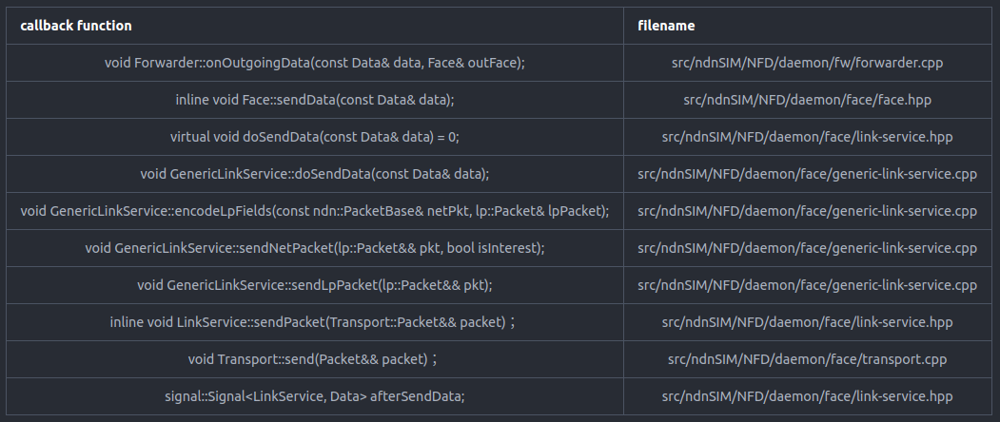

# 介绍一下接收网络数据包的流程(the process of receiving network-layer packet)

## startProcessData
```cpp
void startProcessData(Face& face, const Data& data){
    this->onIncomingData(face, data);
}
```
## onIncomingData
```cpp
void Forwarder::onIncomingData(Face& inFace, const Data& data){

  // receive Data
  // 记录数据包的传入接口和名称
  NFD_LOG_DEBUG("onIncomingData face=" << inFace.getId() << " data=" << data.getName());
  // 设置数据包的IncomingFaceIdTag
  data.setTag(make_shared<lp::IncomingFaceIdTag>(inFace.getId()));
  // 收到的数据包个数递增
  ++m_counters.nInData;

  // localhost scope control
  // 本地主机作用域控制
  bool isViolatingLocalhost = inFace.getScope() == ndn::nfd::FACE_SCOPE_NON_LOCAL &&
                              scope_prefix::LOCALHOST.isPrefixOf(data.getName());
  if (isViolatingLocalhost) {
    NFD_LOG_DEBUG("onIncomingData face=" << inFace.getId() <<
                  " data=" << data.getName() << " violates /localhost");
    // (drop)
    // 违反本地主机作用域，丢弃该packet
    return;
  }

  // PIT match
  // 先匹配PIT，找到所有能够被data满足的pitEntry
  pit::DataMatchResult pitMatches = m_pit.findAllDataMatches(data);
  // 未请求数据
  if (pitMatches.size() == 0) {
    // goto Data unsolicited pipeline
    //在PIT表中找不到对该数据包的请求条目，将其送入未请求通道
    this->onDataUnsolicited(inFace, data);
    return;
  }

  //DataPacket的数据副本
  shared_ptr<Data> dataCopyWithoutTag = make_shared<Data>(data);
  dataCopyWithoutTag->removeTag<lp::HopCountTag>();


  /****************************cache data copy************************************/
  // CS insert，先缓存数据包的副本
  //按照某种策略缓存该数据包
  //m_cs：2版本的实现的ContentStore
  //m_csFromNdnSim：1版本实现的ContentStore

  //默认的LCE策略
  if (m_csFromNdnSim == nullptr)
    m_cs.insert(*dataCopyWithoutTag);
  else
    m_csFromNdnSim->Add(dataCopyWithoutTag);
  /****************************cache data copy************************************/

  /******************************match interest*************************************/
  // when only one PIT entry is matched, trigger strategy: after receive Data
  // 当只有一个PIT表项匹配时，触发策略：after receive Data
  if (pitMatches.size() == 1) {
    auto& pitEntry = pitMatches.front();

    NFD_LOG_DEBUG("onIncomingData matching=" << pitEntry->getName());

    // set PIT expiry timer to now
    // 唯一的兴趣得到了满足，将PIT entry设置为立即过期
    this->setExpiryTimer(pitEntry, 0_ms);

    beforeSatisfyInterest(*pitEntry, inFace, data);
    // trigger strategy: after receive Data
    this->dispatchToStrategy(*pitEntry,
      [&] (fw::Strategy& strategy) { strategy.afterReceiveData(pitEntry, inFace, data); });

    // mark PIT satisfied
    pitEntry->isSatisfied = true;
    pitEntry->dataFreshnessPeriod = data.getFreshnessPeriod();

    // Dead Nonce List insert if necessary (for out-record of inFace)
    this->insertDeadNonceList(*pitEntry, &inFace);

    // delete PIT entry's out-record
    pitEntry->deleteOutRecord(inFace);
  }
  // when more than one PIT entry is matched, trigger strategy: before satisfy Interest,
  // and send Data to all matched out faces
  // 当多个PIT条目匹配时，触发策略:before satisfy interest，并将数据发送给所有匹配的faces
  else {
    // 存储所有未过期的可以由数据满足的兴趣的requesting faces
    std::set<Face*> pendingDownstreams;
    // 获取现在的时间用于判断inRecord是否过期
    auto now = time::steady_clock::now();

    // 遍历所有满足条件的pitEntry
    for (const shared_ptr<pit::Entry>& pitEntry : pitMatches) {
      // 记录日志
      NFD_LOG_DEBUG("onIncomingData matching=" << pitEntry->getName());

      // remember pending downstreams
      // 遍历pitEntry中requesting faces
      for (const pit::InRecord& inRecord : pitEntry->getInRecords()) {
      //需要在兴趣包的过期时间以内收到数据包才可以
        if (inRecord.getExpiry() > now) {
          pendingDownstreams.insert(&inRecord.getFace());
        }
      }

      // set PIT expiry timer to now
      this->setExpiryTimer(pitEntry, 0_ms);

      // invoke PIT satisfy callback
      beforeSatisfyInterest(*pitEntry, inFace, data);
      this->dispatchToStrategy(*pitEntry,
        [&] (fw::Strategy& strategy) { strategy.beforeSatisfyInterest(pitEntry, inFace, data); });

      // mark PIT satisfied
      pitEntry->isSatisfied = true;
      pitEntry->dataFreshnessPeriod = data.getFreshnessPeriod();

      // Dead Nonce List insert if necessary (for out-record of inFace)
      //
      this->insertDeadNonceList(*pitEntry, &inFace);

      // clear PIT entry's in and out records
      //清除PIT条目的所有InRecord
      pitEntry->clearInRecords();
      // 删除PIT条目OutRecord中数据的传入face
      pitEntry->deleteOutRecord(inFace);
    }

    // foreach pending downstream
    // 将数据从兴趣包传入的face沿着下游返回给数据请求者
    for (Face* pendingDownstream : pendingDownstreams) {
      // 如果兴趣的requestingface是数据传入的face什么也不做
      if (pendingDownstream->getId() == inFace.getId() &&
          pendingDownstream->getLinkType() != ndn::nfd::LINK_TYPE_AD_HOC) {
        continue;
      }
      // goto outgoing Data pipeline
      // 发送数据，发送数据的具体流程如最下面的图所示
      this->onOutgoingData(data, *pendingDownstream);
    }
  }
  /******************************match interest*************************************/
}
```

## 匹配PIT---findAllDataMatches
声明在src/ndnSIM/NFD/daemon/table/pit.hpp
函数原型
```cpp
using DataMatchResult = std::vector<shared_ptr<Entry>>;
DataMatchResult findAllDataMatches(const Data& data) const;
```

函数实现
```cpp
DataMatchResult Pit::findAllDataMatches(const Data& data) const{


  auto&& ntMatches = m_nameTree.findAllMatches(data.getName(), &nteHasPitEntries);

  DataMatchResult matches;
  for (const name_tree::Entry& nte : ntMatches) {
    // 获取name_tree entry对应的pitEntry
    // 范围for遍历
    for (const shared_ptr<Entry>& pitEntry : nte.getPitEntries()) {
      // 如果pitEntry里面存储的兴趣能够被数据满足，记录在matches
      if (pitEntry->getInterest().matchesData(data))
        matches.emplace_back(pitEntry);
    }
  }

  return matches;
}
```

### findAllMatches
声明在src/ndnSIM/NFD/daemon/table/name-tree.hpp

函数原型
```cpp
// 找到name-tree中name所有匹配的前缀，并且满足entrySelector
Range findAllMatches(const Name& name, const EntrySelector& entrySelector = AnyEntry()) const;
```

函数实现
```cpp
boost::iterator_range<NameTree::const_iterator>
NameTree::findAllMatches(const Name& name, const EntrySelector& entrySelector) const
{
  // As we are using Name Prefix Hash Table, and the current LPM() is
  // implemented as starting from full name, and reduce the number of
  // components by 1 each time, we could use it here.
  // For trie-like design, it could be more efficient by walking down the
  // trie from the root node.
  /**
  * 由于我们正在使用名称前缀哈希表，并且当前的LPM()是从全名开始实现的，并且每次减少1个组件的数量，因此我们可以在这里使用它。
  * 对于trie-like的设计，从根节点沿着树向下走可能会更有效。
  */
  // 找到最长前缀对应的nametree-entry
  Entry* entry = this->findLongestPrefixMatch(name, entrySelector);
  // 最长前缀以下的前缀都是可能满足该name的前缀
  return {Iterator(make_shared<PrefixMatchImpl>(*this, entrySelector), entry), end()};
}
```

### findLongestPrefixMatch
声明在src/ndnSIM/NFD/daemon/table/name-tree.hpp

函数原型
```cpp
Entry*
findLongestPrefixMatch(const Name& name,
                       const EntrySelector& entrySelector = AnyEntry()) const;
```

函数实现
```cpp
Entry*
NameTree::findLongestPrefixMatch(const Name& name, const EntrySelector& entrySelector) const{
  // name.size()返回组成name的components的个数
  size_t depth = std::min(name.size(), getMaxDepth());
  // 计算name所有前缀对应的hash值
  HashSequence hashes = computeHashes(name, depth);

  // 从最长的前缀开始匹配
  for (ssize_t i = depth; i >= 0; --i) {
    // 在name_hashtable中寻找name长度为i的前缀
    const Node* node = m_ht.find(name, i, hashes);
    // 找到node并且满足entrySelector，返回node对应的name_tree entry
    if (node != nullptr && entrySelector(node->entry)) {
      return &node->entry;
    }
  }
  // 一个前缀没找到返回nullptr
  return nullptr;
}
```

## strategy----afterReceiveData
当只有一个PIT表项匹配时，触发策略：after receive Data
声明在src/ndnSIM/NFD/daemon/fw/strategy.hpp

函数原型
```cpp
// 虚函数
virtual void
afterReceiveData(const shared_ptr<pit::Entry>& pitEntry,
                 const Face& inFace, const Data& data);
```
strategy.cpp的实现
```cpp
void
Strategy::afterReceiveData(const shared_ptr<pit::Entry>& pitEntry,
                           const Face& inFace, const Data& data){
  // 记录日志                           
  NFD_LOG_DEBUG("afterReceiveData pitEntry=" << pitEntry->getName() <<
                " inFace=" << inFace.getId() << " data=" << data.getName());
  // 不同的策略有不同的实现，这个函数在接收兴趣包流程---cache hit时介绍过
  this->beforeSatisfyInterest(pitEntry, inFace, data);
  //
  this->sendDataToAll(pitEntry, inFace, data);
}
```

### sendDataToAll
声明在src/ndnSIM/NFD/daemon/fw/strategy.hpp

函数原型
```cpp
void sendDataToAll(const shared_ptr<pit::Entry>& pitEntry, const Face& inFace, const Data& data);
```

函数实现
```cpp
void
Strategy::sendDataToAll(const shared_ptr<pit::Entry>& pitEntry, const Face& inFace, const Data& data){

  // 存储数据包可以满足的兴趣的所有传入face
  std::set<Face*> pendingDownstreams;
  // 获取现在的时间，为了判断兴趣是否超时
  auto now = time::steady_clock::now();

  // remember pending downstreams
  // 遍历pitEntry中兴趣包对应的所有requestingFaces
  for (const pit::InRecord& inRecord : pitEntry->getInRecords()) {
    // 首先判断从inRecord传入的兴趣是否过期
    if (inRecord.getExpiry() > now) {
      // 如果当前遍历到的inRecord的face是数据包传来的face，不执行任何操作
      if (inRecord.getFace().getId() == inFace.getId() &&
          inRecord.getFace().getLinkType() != ndn::nfd::LINK_TYPE_AD_HOC) {
        continue;
      }
      // 将该face存储起来
      pendingDownstreams.insert(&inRecord.getFace());
    }
  }

  // 现在已经找到兴趣对应的未过期的requesting face
  // 将数据从所有face从下游返回给数据请求者
  for (const Face* pendingDownstream : pendingDownstreams) {
    this->sendData(pitEntry, data, *pendingDownstream);
  }
}
```




## DeadNonceList

#### 源码src/ndnSIM/NFD/daemon/table/dead-nonce-list.hpp给出的解释
```cpp
/** \brief represents the Dead Nonce list
 *
 *  The Dead Nonce List is a global table that supplements PIT for loop detection.
 *  When a Nonce is erased (dead) from PIT entry, the Nonce and the Interest Name is added to
 *  Dead Nonce List, and kept for a duration in which most loops are expected to have occured.
 *
 *  To reduce memory usage, the Interest Name and Nonce are stored as a 64-bit hash.
 *  There could be false positives (non-looping Interest could be considered looping),
 *  but the probability is small, and the error is recoverable when consumer retransmits
 *  with a different Nonce.
 *
 *  To reduce memory usage, entries do not have associated timestamps. Instead,
 *  lifetime of entries is controlled by dynamically adjusting the capacity of the container.
 *  At fixed intervals, the MARK, an entry with a special value, is inserted into the container.
 *  The number of MARKs stored in the container reflects the lifetime of entries,
 *  because MARKs are inserted at fixed intervals.
 */
 /** 表示Dead Nonce List

* Dead Nonce List是一个全局表，它补充了PIT用于循环检测。当Nonce从PIT条目中被擦除(死亡)时，
* Nonce和Interest name被添加到Dead Nonce列表，并保留一段时间，其中大多数循环预计已经发生。

* 为了减少内存使用，兴趣名称和Nonce存储为64位哈希。
* 可能有误报(非循环的兴趣可能被认为是循环的)，
* 但是概率很小，当消费者用不同的Nonce重传时错误是可以恢复的
*

* 为了减少内存使用，条目没有关联时间戳。相反,通过动态调整容器容量来控制条目的生存期。[就好像用双链表实现的LRU]
* 每隔一段固定的时间，在容器中插入带有特殊值的MARK表项。容器中存储的标记数量反映了条目的生命周期;因为标记是以固定的间隔插入的。
* /
```


#### 论文<<NFD Developer’s Guide>>给出的解释
>Dead Nonce List 是一种数据结构，可作为PIT的补充，用于循环检测。2014年8月，我们发现当 InterestLifetime较短时会出现持续循环问题（Bug 1953）。循环检测以前只使用存储在PIT条目中的 Nonces。如果一个兴趣在InterestLifetime内未被满足，PIT条目会在 InterestLifetime结束时被删除。
>当网络中包含一个延迟时间长于InterestLifetime的周期时，无法检测到围绕该周期循环的Interest，因为在Interest循环返回之前，PIT条目已经消失。
>解决这种持续循环问题的一种简单方法是延长PIT条目的保存时间。但是，这样做的内存消耗太高，因为PIT条目除了Nonce之外还包含许多其他内容。因此，引入了Dead Nonce List来存储PIT中"死"的Nonces。
>Dead Nonce List是NFD中的一个全局容器。该容器中的每个条目都存储了interest name和Nonce的元组。可以高效地查询条目是否存在。条目会保留一段时间，在这段时间之后，Interest就不太可能再返回循环。

>结构、语义、用法
>在out-records被删除之前，会在incoming Data pipeline和Interest finalize pipeline记录包含
nonce和name的元组
在incoming Interest pipeline中查询Dead Nonce List。如果存在相同的name+nonce条目，则判定传入的兴趣为循环兴趣
Dead Nonce List是一种概率型数据结构；每个条目不是直接存储nonce+name，而是nonce和name的64bit的
散列值。大大减少了内存的消耗。与此同时，哈希碰撞的缘故使得该结构会产生误报(非循环兴趣被误认为是循环)
这些误报是可以恢复的，数据请求者使用新的Nonce重传兴趣，会产生不同的哈希值，不会与现有的哈希值发生碰撞。节省的内存的收益大于误报的危害。

>容量设计
条目在Dead Nonce List中保留的时间是可配值的。条目生命周期是"循环检测效果、容器内存消耗、误报概率
之间的权衡"。较长的生命周期可以提高循环检测的有效性，因为只有在条目被删除之前循环返回，才能检测到循环兴趣。但是生命周期越长，需要存储的条目就越多，从而增加容器的内存消耗；条目越多，哈希碰撞的概率就越高，从而导致误报。生命周期默认是6s
实现条目生命周期最简单的方式就是在每个条目中保留一个时间戳，这种方法会消耗太多内存。鉴于DeadNonceList是一个概率数据结构，条目生命周期不需要很精确。因此将容器的索引设置为先入先出队列
并通过调整容器容量将条目生命周期近似为时间戳实现的生命周期
静态配置容器的容量是不可性的，因为添加条目的频率与兴趣的到达速率相关，然而无法准确评估兴趣到达率。因此采用以下算法动态调整容器的容量； L：excepted entry lifetime
 + 在间隔 M 时，我们会在容器中添加一个名为mark的特殊条目。mark没有独特的类型：它是一个具有特定值的条目，假设哈希函数是不可反转的，因此与由 Name 和 Nonce 计算出的哈希值发生碰撞的概率很低。
 + 在间隔 M 时，数一数容器中的mark数量，并记住这个数。添加mark和清点marks之间的顺序并不重要，但应保持一致。
 + 在间隔 A 处，我们查看最近的计数。当容器的容量达到最佳状态时，容器内应始终有 L/M 标记。如果最近的计数都高于 L/M，容量就会被调低。如果最近的计数都低于 L/M，则容量会被调高。

 此外，为了避免内存溢出并确保操作的正确性，容量有一个硬性的上限和下限。当容量下调时，为了限制算法的执行时间，多余的条目不会被一次性驱逐，而是在以后的添加操作中分批驱逐[渐进式驱逐]


#### 代码实现
```cpp
void Forwarder::insertDeadNonceList(pit::Entry& pitEntry, Face* upstream){

  // need Dead Nonce List insert?
  // 判断是否需要将即将要擦除的pitEntry的nonce+name记录在dead nonce list
  bool needDnl = true;
  /** 需要记录dead nonce list需要满足的条件
  * 1.首先pitEntry是处于被数据满足的状态
  * 2.断言数据的新鲜度周期大于等于0(ms)
  * 3.兴趣要求数据必须是新鲜的，并且数据新鲜度周期小于deadnoncelist的期望寿命
  */
  if (pitEntry.isSatisfied) {
    BOOST_ASSERT(pitEntry.dataFreshnessPeriod >= 0_ms);
    // getLifetime返回期望的寿命，单位是纳秒
    needDnl = static_cast<bool>(pitEntry.getInterest().getMustBeFresh()) &&
              pitEntry.dataFreshnessPeriod < m_deadNonceList.getLifetime();
  }

  if (!needDnl) {
    return;
  }

  // Dead Nonce List insert
  if (upstream == nullptr) {
    // insert all outgoing Nonces
    const auto& outRecords = pitEntry.getOutRecords();
    std::for_each(outRecords.begin(), outRecords.end(), [&] (const auto& outRecord) {
      m_deadNonceList.add(pitEntry.getName(), outRecord.getLastNonce());
    });
  }
  else {
    // insert outgoing Nonce of a specific face
    auto outRecord = pitEntry.getOutRecord(*upstream);
    if (outRecord != pitEntry.getOutRecords().end()) {
      m_deadNonceList.add(pitEntry.getName(), outRecord->getLastNonce());
    }
  }
}

} // namespace nfd
```

#### DeadNonceList::add
```cpp
// 加入nonce和name
void DeadNonceList::add(const Name& name, uint32_t nonce){
  // 返回的是name+nonce的hash值
  Entry entry = DeadNonceList::makeEntry(name, nonce);
  m_queue.push_back(entry);

  // 因为deadnoncelist的容量是有限的，所以必要的时候需要驱逐一些entry
  this->evictEntries();
}
```

## 

