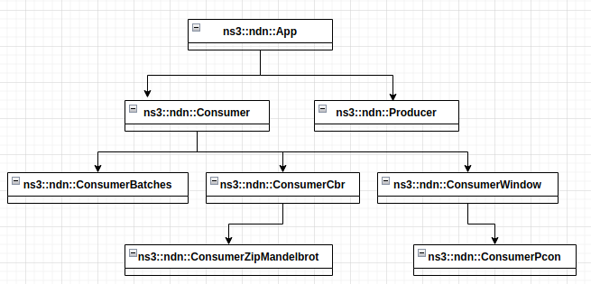
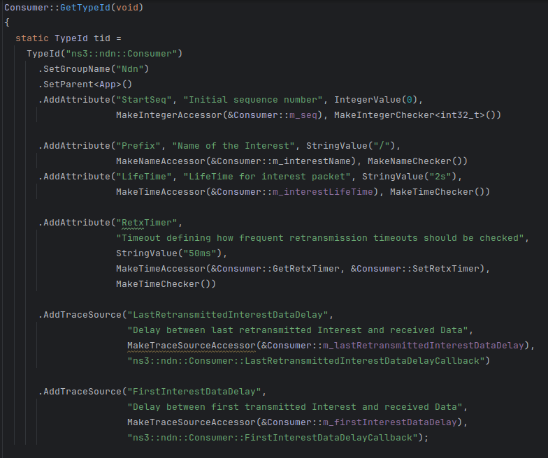
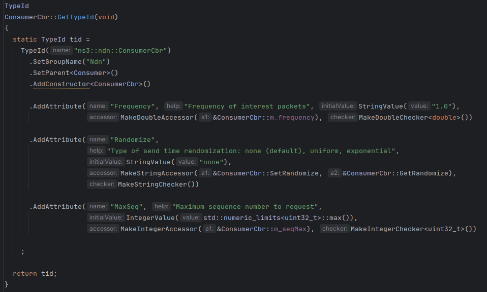
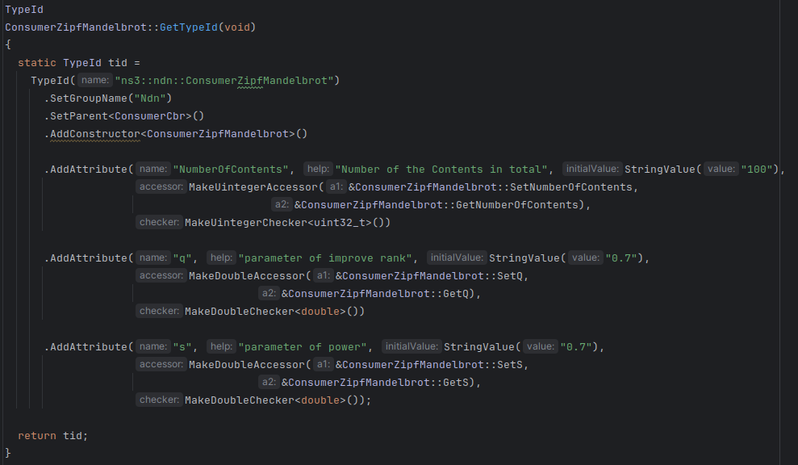

## Consumer
### Attribute
+ StartSeq。初始化序列号(Consumer::m_seq)。默认0，类型是int32_t。
+ Prefix。兴趣包的名字(Consumer::m_interestName)。默认`/`，类型是`Name`。
+ LifeTime。兴趣包的生存周期(Consumer::m_interestLifeTime)。默认2s，类型是`Time`。
+ RetxTimer。定义了一个超时时间，用于确定系统应该多久检查一次是否需要执行重传超时机制。这通常涉及到设置一个计时器，计时器到期时，系统会检查自上次发送数据包以来是否已经过去了预设的RTO时间，如果是的话，就会触发重传机制。默认是50ms(Consumer::GetRetxTimer, Consumer::SetRetxTimer)，类型是`Time`。


## ConsumerCbr
ConsumerCbr：消费者应用程序，根据用户定义的模式（例如，预定义频率、恒定速率、恒定平均速率、兴趣间隙均匀随机分布、指数随机分布等）生成兴趣流量。用户可自定义兴趣名称前缀和序列号。此外，该应用还可根据与 TCP RTO 类似的基于 RTT 的超时周期提供兴趣重传。

### Attribute
+ Frequency。兴趣包的发送频率：生成兴趣的确切频率[对于连续版本]或预期频率[对于随机版本]。(ConsumerCbr::m_frequency)，默认是1.0，类型是double。
+ Randomize。指定是否对兴趣间差距进行随机化(ConsumerCbr::SetRandomize，ConsumerCbr::GetRandomize)。默认none，类型是string。
  + `none`：无随机化
  + `uniform`：范围内均匀分布(1,1/Frequency)
  + `exponential`：平均值为1/Frequency的指数分布
+ MaxSeq。请求的最大序列号(ConsumerCbr::m_seqMax)。默认值是`std::numeric_limits<uint32_t>::max()`，类型是uint32_t

```cpp
// create application using the app helper
AppHelper helper("ns3::ndn::ConsumerCbr");

helper.SetAttribute("Frequency",DoubleValue(1.0));

helper.SetAttribute("Randomize",StringValue("uniform"));

helper.SetAttribute("MaxSeq",IntegerValue(std::numeric_limits<uint32_t>::max()));
```



## ConsumerZipfMandelbrot
ConsumerZipfMandelbrot：消费者应用程序，按照 Zipf-Mandelbrot 分布请求内容（即请求中的名称）。
### Attribute
+ NumberOfContents。内容的总数(ConsumerZipfMandelbrot::GetNumberOfContents，ConsumerZipfMandelbrot::SetNumberOfContents)。默认值是100，类型是`uint32_t`。
+ q。修正排名的参数(ConsumerZipfMandelbrot::SetQ，ConsumerZipfMandelbrot::GetQ)。默认值是0.7，类型是double
+ s。指数参数(ConsumerZipfMandelbrot::SetS，ConsumerZipfMandelbrot::GetS)。默认值是0.7，类型是double。



### ConsumerBatches
ConsumerBatches：消费者应用程序，可在模拟的指定时间点生成指定数量的兴趣数据

### ConsumerWindow
ConsumerWindow：消费者应用程序，用于生成可变速率的利息流量。它实现了一种简单的基于滑动窗口的利息生成机制

### ConsumerPcon
ConsumerPcon：是一个生成可变速率兴趣流量的应用程序。它实现了基于窗口的速率控制，使用 K. Schneider 等人开发的 PCON 拥塞控制机制来调整窗口大小。 （ https://named-data.net/publications/practical_congestion_control_scheme/ ）。它继承自ConsumerWindow。

### Producer
Producer：一个简单的应用程序，用于汇入兴趣流量并生成数据流量。具体来说，它会用一个数据包响应每个传入的兴趣数据包，该数据包的大小和名称与相应的传入兴趣数据包相同。


应用程序与模拟器核心的交互是通过 ndn::AppLinkService 实现的 nfd::face::LinkService 抽象来实现的。
基类 ndn::App 负责创建/删除 ndn::AppLinkService 实例及其在协议栈中的注册。
