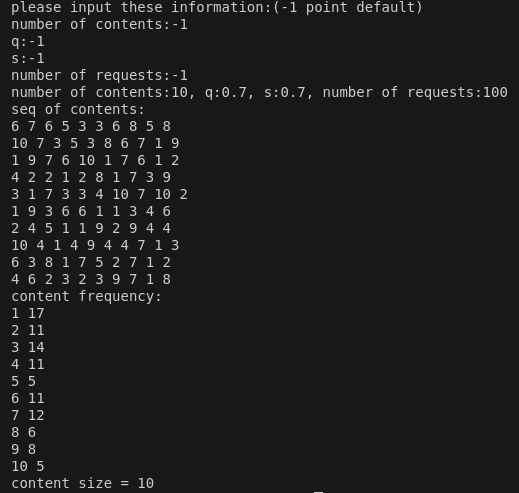

# 齐夫分布

## 理论

[维基百科----齐夫分布](http://en.wikipedia.org/wiki/Zipf%E2%80%93Mandelbrot_law)

在概率论和统计学中，Zipf-Mandelbrot定律是一种离散概率分布。

假设$r$是数据的排名，$q和s$是分布的参数。排名$r$的内容被选中的概率(与其排名成反比)定义如下：
$$
f(r) =\frac{1}{(r+q)^s}
$$


## 实现

### 前置知识

#### 一维前缀和

先看这样一道题目

输入一个长度为n的整数序列

接下来再输入m个询问，每个询问输入一对$l,r$

对于每个询问，输出原序列中从第$l$个数到第$r$个数的和。

**输入格式**

第一行包含两个整数$n$和$m$

第二行包含$n$个整数，表示整数数列

接下来$m$行，每行包含两个整数$l$和$r$，表示一个询问的区间范围。

**输出格式**

共$m$行，每行输出一个询问的结果

**数据范围**
$$
1 \le l \le r \le n \\
1 \le n,m \le 100000 \\
-1000 \le 数列中元素的值 \le 1000
$$


**输入样例**

> 5 3
>
> 2 1 3 6 4
>
> 1 2
>
> 1 3
>
> 2 4

**输出样例**

> 3
>
> 6
>
> 10

分析上述的题目：

- 暴力解法。对于每个询问的区间，遍历一边原数组，计算这个区间的和。时间复杂度为O(nm)，其中n是原数组的长度，m是询问的区间个数。对于本题来说n和m的最大值都是1e5，总的时间复杂度就是1e10，会超时。

- 前缀和。

  - $$
    假设s数组是a数组的前缀和。则有\\
    s_i = a_1 + \cdots + a_i\\
    若要求a数组某个区间的和，则可以由前缀和数组s得到\\
    sum_{a_l,a_r} = s_r - s_{l-1}\\
    推导过程如下\\
    s_r = a_1 + \cdots + a_{l-1} +a_l+\cdots + a_r \\ 
    s_{l-1} = a_1 + \cdots + a_{l-1}
    上述两个式子相减可以得到\\
    s_r - s_{l-1} = a_l + \cdots + a_r
    $$

  - 用前缀和优化之后，时间复杂度变为O(n+m)，其中求前缀和数组的时间复杂度为O(n)，计算每个询问区间的时间复杂度为O(m)，故总的时间复杂度为O(n+m)。利用前缀和求区间和的代码如下

```cpp
#include<iostream>
using namespace std;

const int N = 100010;
int n,m;

int a[N],s[N];

int main(){
    cin>>n>>m;
    // 输入数据
    for(int i=1;i<=n;i++) scanf("%d",&a[i]);
    
    //计算前缀和
    for(int i=1;i<=n;i++) s[i] = s[i-1] + a[i];
    
    // 输入数据和计算前缀和可以和并为一步
    //for(int i=1;i<=n;i++){
    //    scanf("%d",&a[i]);
    //    s[i] = s[i-1] + a[i];
    //}
    
    // 计算区间和
    while(m--){
        int l,r;
        cin>>l>>r;
        cout<<s[r]-s[l-1]<<endl;
    }
    return 0;
}
```


#### 轮盘赌算法

[轮盘赌选择算法](https://www.cnblogs.com/qi-yuan-008/p/12718129.html)


### 实践

先来欣赏一下，src/ndnSIM/apps/ndn-consumer-zipf-mandelbrot.cpp中给出的源码，核心的函数如下

```cpp
/* 设置内容个数的同时，计算每个内容的累积概率分布
* 1.在计算每个内容出现频率的同时，原地计算每个内容的累积选中频率[等同于输入数据的同时求前缀和]
* 2.在第一步中所有内容的频率之和已经被求出来即最后一个内容的累积频率(很巧秒)，此时计算每个内容的累积概率。
*/
void ConsumerZipfMandelbrot::SetNumberOfContents(uint32_t numOfContents)
{
  m_N = numOfContents;

  NS_LOG_DEBUG(m_q << " and " << m_s << " and " << m_N);

  m_Pcum = std::vector<double>(m_N + 1);

  m_Pcum[0] = 0.0;
  // 计算累积选中频率
  for (uint32_t i = 1; i <= m_N; i++) {
    m_Pcum[i] = m_Pcum[i - 1] + 1.0 / std::pow(i + m_q, m_s);
  }
  /* 上述过程，拆分来开就是
  *  先计算每个内容的选中频率
  std::vector<double> mp(m_N+1);
  for(uint32_t i = 1;i<=m_N; i++){
      mp[i] = 1.0 / std::pow(i+m_q,m_s);
  }
  // 计算内容的累积选中频率
  for(int i=1;i<=m_N;i++){
      m_Pcum[i] = m_Pcum[i-1] + mp[i];
  }
  */
  // 计算累积概率
  for (uint32_t i = 1; i <= m_N; i++) {
    m_Pcum[i] = m_Pcum[i] / m_Pcum[m_N];
    NS_LOG_LOGIC("Cumulative probability [" << i << "]=" << m_Pcum[i]);
  }
}
```

```cpp
// 根据累积概率分布选择内容
uint32_t ConsumerZipfMandelbrot::GetNextSeq()
{
  uint32_t content_index = 1; //[1, m_N]
  double p_sum = 0;

  // 生成一个[0,1]之间的随机浮点数值
  double p_random = m_seqRng->GetValue();
  while (p_random == 0) {
    p_random = m_seqRng->GetValue();
  }
  // if (p_random == 0)
  NS_LOG_LOGIC("p_random=" << p_random);
  // 遍历内容的累积概率，哪个内容的累计概率大于等于生成的随机数，哪个内容就被选中。
  for (uint32_t i = 1; i <= m_N; i++) {
    p_sum = m_Pcum[i]; // m_Pcum[i] = m_Pcum[i-1] + p[i], p[0] = 0;   e.g.: p_cum[1] = p[1],
                       // p_cum[2] = p[1] + p[2]
    if (p_random <= p_sum) {
      content_index = i;
      break;
    } // if
  }   // for
  // content_index = 1;
  NS_LOG_DEBUG("RandomNumber=" << content_index);
  return content_index;
}
```

这个代码真是太优雅了！！！

-----------

下面是自己实现的一个齐夫分布的类，源文件在`./zipf/`

```cpp
class Zipf{
    public:
        Zipf():NumberofContents(10),m_q(0.7),m_s(0.7),P_Scum(NumberofContents+1,0.0){
            init();

        }
        Zipf(uint32_t n,double q,double s):NumberofContents(n),m_q(q),m_s(s),P_Scum(NumberofContents+1,0.0){
            init();
        }
        uint32_t getNext(){
            double r = getRandomValue();
            for(uint32_t i=1;i<=NumberofContents;i++){
                if(r<P_Scum[i]){
                    return i;
                }
            }
            return 0;
        }
        void getContent(uint32_t N,std::vector<uint32_t>&cons){
            // get N content
            for (uint32_t i = 0; i < N; i++){
                cons.push_back(getNext());
            }
        }
        ~Zipf(){}
    private:
        void init(){
            for(uint32_t i=1;i<=NumberofContents;i++){
                P_Scum[i]=P_Scum[i-1] + 1.0/(std::pow(i+m_q,m_s));
            }

            for(uint32_t i=1;i<=NumberofContents;i++){
                P_Scum[i] /= P_Scum[NumberofContents];
            }
        }
    private:
         uint32_t NumberofContents;
         double m_q;
         double m_s;
         // P_Scum
         std::vector<double> P_Scum;
         // 1.0/(n+m_q)^m_s
    };
```


### 演示




