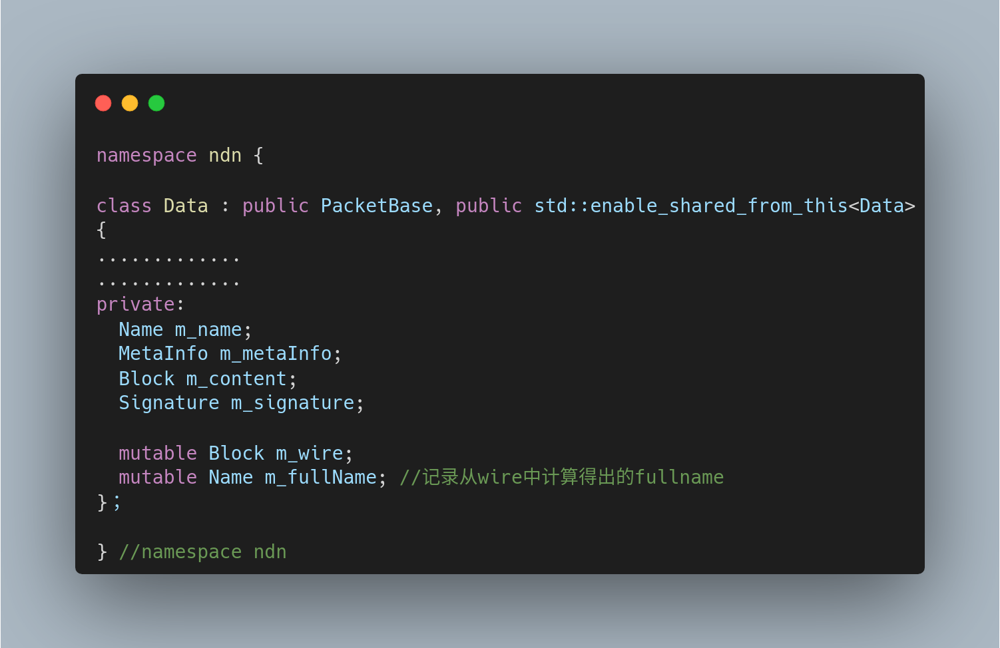

# 从源码的角度看数据包
首先看一下Data类大致的框架，这里只从源码中摘取主要的部分


ndn-cxx/detail/tag-host.hpp
TagHost的声明
```cpp
//ndn-cxx/detail/tag-host.hpp
#include "ndn-cxx/tag.hpp"
class TagHost
{
public:
  // T：必须是ndn::tag的子类。获取标签项，没有返回nullptr
  template<typename T>
  shared_ptr<T>getTag() const;

  // 设置标签项。
  // 由于m_tags被设置成mutable可变的所以即使是在const函数内也是可以被修改的
  template<typename T>
  void setTag(shared_ptr<T> tag) const;

  // 移除标签
  // 由于m_tags被设置成mutable可变的所以即使是在const函数内也是可以被修改的
  template<typename T>
  void removeTag() const;

private:
  mutable std::map<int, shared_ptr<Tag>> m_tags;
};
```
TagHost的定义
```cpp
template<typename T>
shared_ptr<T> TagHost::getTag() const{

  //断言T是不是继承ndn::Tag类型；T must inherit from Tag
  static_assert(std::is_base_of<Tag, T>::value, "T must inherit from Tag");

  auto it = m_tags.find(T::getTypeId());
  if (it == m_tags.end()) {
    return nullptr;
  }
  //强制转换成指针类型并返回
  return static_pointer_cast<T>(it->second);
}

template<typename T>
void TagHost::setTag(shared_ptr<T> tag) const{

  static_assert(std::is_base_of<Tag, T>::value, "T must inherit from Tag");

  //tag为nullptr就执行删除操作
  if (tag == nullptr) {
    m_tags.erase(T::getTypeId());
  }
  else {
    // 使用移动构造函数，将tag的所有权转移给m_tags[T::getTypeId()]对应的对象
    m_tags[T::getTypeId()] = std::move(tag);
  }
}

template<typename T>
void TagHost::removeTag() const{
  setTag<T>(nullptr);
}
```

ndn-cxx/detail/packet-base.hpp
```cpp
// ndn-cxx/detail/packet-base.hpp
class PacketBase : public TagHost
{
public:
  //获取conessitionmark标记的值       
  uint64_t getCongestionMark() const;

  //将congtionmark标记设置为指定的值
  void setCongestionMark(uint64_t mark);
};
```

ndn-cxx/data.hpp
std::enable_shared_from_this
当类继承自std::enable_shared_from_this时，可以在类的成员函数中调用shared_from_this()来获取一个std::shared_ptr指向当前对象
这在以下情况下非常有用：
+ 当你的对象被其他对象以std::shared_ptr持有，但你想要在对象内部访问这个共享指针。
+ 当你想要在构造函数中创建一个std::shared_ptr指向新创建的对象，并将其传递给其他组件。
需要注意的是，shared_from_this()只能在对象已经被std::shared_ptr管理时调用。如果在对象没有被 std::shared_ptr 管理的情况下调用shared_from_this()，将会导致未定义行为。
此外，shared_from_this()通常用于避免循环引用，因为它可以在对象的生命周期内安全地创建新的std::shared_ptr实例。
shared_from_this:
+ 它确保只有在对象已经被std::shared_ptr管理时，才能通过shared_from_this()获取 std::shared_ptr。
+ 它避免了在对象构造期间或销毁后尝试获取std::shared_ptr，从而避免了未定义行为。
+ 它允许std::shared_ptr与对象的生命周期同步，确保在对象销毁时std::shared_ptr的引用计数能够正确减少到零。

```cpp
class Data : public PacketBase, public std::enable_shared_from_this<Data>
public:
{
  class Error : public tlv::Error
  {
  public:
    using tlv::Error::Error;
  };

  // 构造一个具有给定名称和空内容的无符号数据包。
  // 在使用'Data::shared_from_this()'的特定上下文中，必须使用make_shared创建Data
  // 否则，'shared_from_this()'将触发未定义的行为。

  explicit Data(const Name& name = Name());

  // 通过从wire解码构造一个数据包。
  // wire tlv:: NDN包格式v0.2或v0.3定义的数据元素。
  explicit Data(const Block& wire);


  // NDN Packet Format v0.2.
  // 编码EncodingEstimator或EncodingBuffer实例
  /*
  * wantUnsignedPortionOnly如果为true，只添加Name, MetaInfo, Content和SignatureInfo到编码器，
  * 但是忽略SignatureValue和outmost Type-Length of Data元素。这将用于wireEncode(encoder, signatureValue)。
  */
  // 如果wantUnsignedPortionOnly为false，不会提供SignatureBits。
  template<encoding::Tag TAG>
  size_t wireEncode(EncodingImpl<TAG>& encoder, bool wantUnsignedPortionOnly = false) const;


  // 使用指定的SignatureValue完成数据包编码
  // EncodingBuffer包含Name、MetaInfo、Content和SignatureInfo，
  // 但不包含SignatureValue和outmost Data元素SignatureValue的Type-Length
  /*
   *  此方法旨在与Data::wireEncode(encoder, true)配合使用。
   *  @code
   *     Data data;
   *     ...
   *     EncodingBuffer encoder;
   *     data.wireEncode(encoder, true);
   *     ...
   *     Block signatureValue = <sign_over_unsigned_portion>(encoder.buf(), encoder.size());
   *     data.wireEncode(encoder, signatureValue)
   *  @endcode
   */
  const Block& wireEncode(EncodingBuffer& encoder, const Block& signatureValue) const;


  // 编码到一个Block。对数据进行签名。
  // 正常情况下，该功能编码为NDN报文格式v0.2。但是，如果这个实例缓存了wire code(hasWire()为true)，则返回缓存的编码，并且可能是v0.3格式。
  const Block& wireEncode() const;

  // Decode from wire in NDN Packet Format v0.2 or v0.3.
  void wireDecode(const Block& wire);

  // Check if this instance has cached wire encoding.
  bool hasWire() const{
    return m_wire.hasWire();
  }

  // 获取全名，包括隐式摘要
  // hasWire() == true;也就是说，必须调用wireEncode()
  const Name& getFullName() const;

public: // Data fields

  const Name& getName() const{
    return m_name;
  }

  //返回对该数据的引用，以允许对该数据的链接操作
  Data& setName(const Name& name);


  const MetaInfo& getMetaInfo() const{
    return m_metaInfo;
  }


  Data& setMetaInfo(const MetaInfo& metaInfo);

  // Content值可以通过Block类的value()/value_size()或value_begin()/value_end()方法访问。
  const Block& getContent() const;


  // 如果block的TLV-TYPE是Content，它将直接用作Data的Content元素。
  // 如果块的TLV-TYPE不是Content，它将被嵌套到Content元素中。
  Data& setContent(const Block& block);


  // 从raw buffer中复制contentvalue
  // value指向值的第一个八位字节
  // valueSize是raw buffer的大小
  Data& setContent(const uint8_t* value, size_t valueSize);

  //从wire buffer中设置content
  // value内容值，不需要是TLV元素
  Data& setContent(ConstBufferPtr value);


  const Signature& getSignature() const{
    return m_signature;
  }


  Data& setSignature(const Signature& signature);


  Data& setSignatureValue(const Block& value);

public: // MetaInfo fields

/****************ContentType***********/
  uint32_t getContentType() const{
    return m_metaInfo.getType();
  }

  Data& setContentType(uint32_t type);
  /****************ContentType***********/


  /****************freshnessPeriod*********************************/
  //新鲜度周期的单位是毫秒
  time::milliseconds getFreshnessPeriod() const{
    return m_metaInfo.getFreshnessPeriod();
  }

  Data& setFreshnessPeriod(time::milliseconds freshnessPeriod);
/****************freshnessPeriod************************************/


/****************FinalBlock***************************************/
  const optional<name::Component>& getFinalBlock() const{
    return m_metaInfo.getFinalBlock();
  }

  Data& setFinalBlock(optional<name::Component> finalBlockId);
/****************FinalBlock*************************************/

protected:
  // Clear wire encoding and cached FullName
  // This does not clear the SignatureValue.
  void resetWire();

private:
  Name m_name;
  MetaInfo m_metaInfo;
  Block m_content;
  Signature m_signature;

  mutable Block m_wire;
  mutable Name m_fullName; ///< cached FullName computed from m_wire
};
```
从Data类中可以看出，Data Packet的大致结构如下：

这个结构与最新版本v0.3的格式规范一致，v0.3格式规范参考网址[NDN Packet Format v0.3.](https://docs.named-data.net/NDN-packet-spec/current/data.html)
