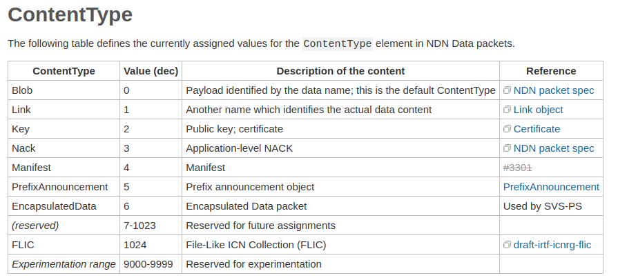

首先看一下MetaInfo的格式规范

MetaInfo = META-INFO-TYPE TLV-LENGTH
             [ContentType]
             [FreshnessPeriod]
             [FinalBlockId]
以上是NDN Packet Formatv0.3给出的格式规范，源代码中给出的结构如下所示，

[ContentType]是指Content的类型，官方文档给出的类型有以下几种：

可以参考链接[Data Packet-MetaInfo-ContentType](https://redmine.named-data.net/projects/ndn-tlv/wiki/ContentType)

```cpp
//ndn-cxx/encoding/tlv.hpp
enum ContentTypeValue : uint32_t {
  ContentType_Blob      = 0,    ///< payload
  ContentType_Link      = 1,    ///< another name that identifies the actual data content
  ContentType_Key       = 2,    ///< public key, certificate
  ContentType_Nack      = 3,    ///< application-level nack
  ContentType_Manifest  = 4,
  ContentType_PrefixAnn = 5,    ///< prefix announcement
  ContentType_Flic      = 1024, ///< File-Like ICN Collection
};
```

ndn-cxx/meta-info.hpp
```cpp
namespace ndn {

const time::milliseconds DEFAULT_FRESHNESS_PERIOD = time::milliseconds::zero();

/**
 * A MetaInfo holds the meta info which is signed inside the data packet.
 *
 * The class allows experimentation with application-defined meta information blocks,
 * which slightly violates NDN-TLV specification.  When using the application-defined
 * meta information blocks be aware that this may result in packet drop (NFD and
 * previous versions of ndn-cxx will gracefully accept such packet).
 *
 * The following definition of MetaInfo block is assumed in this implementation (compared
 * to the NDN-TLV spec, definition extended to allow optional AppMetaInfo TLV blocks):
 *
 *     MetaInfo ::= META-INFO-TYPE TLV-LENGTH
 *                    ContentType?
 *                    FreshnessPeriod?
 *                    FinalBlockId?
 *                    AppMetaInfo*
 *
 *     AppMetaInfo ::= any TLV block with type in the restricted application range [128, 252]
 *
 * Note that AppMetaInfo blocks are application-defined and must have TLV type from
 * the restricted application range [128, 252].
 */
class MetaInfo
{
public:

  MetaInfo();


  explicit MetaInfo(const Block& block);

  template<encoding::Tag TAG>
  size_t wireEncode(EncodingImpl<TAG>& encoder) const;

  const Block& wireEncode() const;

  void wireDecode(const Block& wire);

public: // getter/setter
  /** return ContentType
   *  If ContentType element is omitted, returns  tlv::ContentType_Blob.
   */
  uint32_t getType() const{
    return m_type;
  }


  //type a number defined in  tlv::ContentTypeValue
  MetaInfo& setType(uint32_t type);


  // If FreshnessPeriod element is omitted, returns  DEFAULT_FRESHNESS_PERIOD.
  time::milliseconds getFreshnessPeriod() const{
    return m_freshnessPeriod;
  }


  //std::invalid_argument specified FreshnessPeriod is negative
  MetaInfo& setFreshnessPeriod(time::milliseconds freshnessPeriod);


  const optional<name::Component>& getFinalBlock() const{
    return m_finalBlockId;
  }


  MetaInfo& setFinalBlock(optional<name::Component> finalBlockId);


public: // app-defined MetaInfo items

  // 获取所有应用程序定义的MetaInfo项
  // 警告:实验性API，将来可能会改变或消失
  // 如果从wire解码MetaInfo，并且在*AppMetaInfo之前调用setType, setFreshnessPeriod或setFinalBlock，则所有应用程序定义的块将丢失
  const std::list<Block>& getAppMetaInfo() const;


  // 实验性API，将来可能会改变或消失
  MetaInfo& setAppMetaInfo(const std::list<Block>& info);


  // 实验性API，未来可能会改变或消失
  MetaInfo& addAppMetaInfo(const Block& block);


  // 实验性API，将来可能会改变或消失
  bool removeAppMetaInfo(uint32_t tlvType);


  // 实验性API，将来可能会改变或消失
  const Block* findAppMetaInfo(uint32_t tlvType) const;

public: // EqualityComparable concept
  bool operator==(const MetaInfo& other) const;

  bool operator!=(const MetaInfo& other) const;

private:
  uint32_t m_type;//content type
  time::milliseconds m_freshnessPeriod;
  optional<name::Component> m_finalBlockId;
  std::list<Block> m_appMetaInfo;

  mutable Block m_wire;
};

NDN_CXX_DECLARE_WIRE_ENCODE_INSTANTIATIONS(MetaInfo);

std::ostream& operator<<(std::ostream& os, const MetaInfo& info);

inline bool MetaInfo::operator==(const MetaInfo& other) const{
  return wireEncode() == other.wireEncode();
}

inline bool MetaInfo::operator!=(const MetaInfo& other) const{
  return !(*this == other);
}

} // namespace ndn
```
