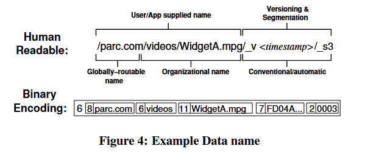

## 隐式摘要

在NDN（命名数据网络）中，数据包名称的隐式摘要（Implicit Digest）起着重要的作用。隐式摘要是NDN数据包名称的一部分，它通常位于名称的最后，并且用于确保数据包内容的完整性和可验证性。隐式摘要通过对数据包内容进行哈希计算得到，这样当数据包在网络中传输时，接收方可以通过对比计算得到的摘要与名称中的隐式摘要是否一致来判断数据包是否在传输过程中被篡改。

隐式摘要的作用包括但不限于以下几点：

1. **数据完整性**：通过验证数据包的隐式摘要，可以确保数据在传输过程中未被篡改。
2. **安全性**：隐式摘要提供了一种机制，使得数据包的接收者可以验证数据的来源和完整性。
3. **缓存优化**：在NDN中，缓存是重要的组成部分。隐式摘要可以帮助缓存系统更有效地识别和存储数据包，因为它提供了一种精确匹配数据包内容的方法。
4. **避免循环**：在NDN的路由过程中，隐式摘要有助于检测和避免潜在的循环，因为它为每个数据包提供了一个唯一的标识。

在实际应用中，隐式摘要是NDN数据包名称设计中的一个重要特性，它为NDN提供了一种内建的安全机制，并且对于提高网络的效率和可靠性至关重要。在实现NDN网络时，隐式摘要的计算和验证是数据包处理流程中不可或缺的一部分。

## Names

CCN名称是不透明的二进制对象，由(显式指定)的多个组件组成，如下图所示。

如果数据包中的ContentName是兴趣包中的ContentName的前缀，则数据满足兴趣。名称通常是分层的，因此这种前缀匹配等同于说数据包位于兴趣包指定的名称子树中。

IP使用此约定解析<网络、子网、主机>的IP地址分层结构，经验表明它允许对路由和转发状态进行高效的分布式分层聚合，同时允许快速查找。此匹配的一个含义是，可能会收到对不存在的内容的兴趣---允许发布者根据特定查询动态生成该内容。

这种活跃的命名方式允许CCN透明地支持静态缓存内容和动态生成内容的混合，这在当今的网络中很常见。名称前缀也可能与上下文相关，例如
/ThisRoom/projector用于与当前房间的显示投影仪交换信息，或/Local/Friends用于与本地(广播)环境中的任何朋友交换信息

CCN节点的基本操作与IP节点非常相似：包到达一个face，按照名字进行最长匹配查找，然后根据查找结果执行动作。CCN包转发引擎核心机制如下图所示

## 两个数据包

CCN通信由数据消费者驱动。CCN包有两种类型：兴趣包和数据包。消费者通过广播其兴趣到所有可用连接请求内容。任何听到兴趣包并拥有满足其内容的节点都可以用数据包响应。数据仅在响应兴趣时才传输，并消耗兴趣。由于兴趣和数据都通过名称标识正在交换的内容，因此多个对相同内容感兴趣的节点可以使用标准的多播抑制技术在广播介质上共享传输。
## 三个主要数据结构

FIB(转发信息库)、ContentStore(缓冲内存)、PIT(待处理兴趣表)

FIB用于将兴趣包转发到潜在的匹配数据源。与IP几乎相同，只是它允许使用多个输出 faces而不是单个输出face
。这反映了CCN不限于在生成树上进行转发这一事实。允许使用多个数据源并行查询所有数据

内容存储与IP路由器的缓冲内存相同，但具有不同的替换策略。由于每个IP数据包都属于单个点对点对话，因此在向下游转发后，它不再具有任何价值。因此，IP在转发完成后立即忘记数据包并收回其缓冲区(MRU替换)

CCN数据包是幂等的、自识别和自验证的，因此每个数据包都可能对许多消费者有用(例如，许多主机阅读同一份报纸或观看同一YouTube视频)为了最大限度提高共享率，从而最小化上行带宽需求和下行延迟，CCN会尽可能长时间地记住到达的数据包(LRU或LFU替换)

PIT跟踪上游转发到内容源的兴趣，以便将返回的数据向下游发送到请求者。在CCN中，只有兴趣包被路由，并且当它们向上游传播到潜在的数据源时，它们会留下"面包屑"痕迹，以便匹配的数据包可以沿着这些痕迹返回到原始请求者。每个PIT条目都是一个面包屑，PIT条目在用于转发匹配的数据包后立即被擦除(数据消耗兴趣)。对于从未找到匹配数据的兴趣的PIT条目，最终会超时

(软状态模型----如果消费者仍然想要数据，需要重新发送兴趣)

## **软状态**

在分布式系统中，"软状态"（Soft State）是指系统中的数据副本在不同节点间可以存在中间状态，这种状态不会影响系统的整体可用性。软状态允许数据在同步过程中有延时，即系统的不同部分可能暂时处于不一致的状态，但这种不一致是可以接受的，并且最终会达到一致性。

软状态的概念与BASE理论中的"最终一致性"（Eventually Consistent）紧密相关。在BASE理论中，系统不保证数据的强一致性，而是允许数据在一段时间内存在不一致，但最终会通过数据同步机制达到一致状态。这种模型适用于那些可以容忍暂时的数据不一致，但需要高可用性的系统。

例如，在电子商务网站中，用户下单后，订单状态可能会在不同服务器之间同步，这个过程中可能会有短暂的不一致状态。但是，系统设计会确保这种不一致不会影响用户的购物体验，最终订单状态会达到一致。

软状态的设计允许系统在面对网络分区或其他故障时保持可用性，即使这意味着牺牲一定程度的数据一致性。这种设计理念在现代分布式系统中非常常见，特别是在那些需要高吞吐量和高可用性的大规模互联网服务中。通过软状态和最终一致性，系统可以在保证基本可用性的同时，通过异步复制和同步机制来解决数据一致性问题。

### 兴趣包的接收流程

当一个兴趣包达到某个face时，会对其ContentName进行最长匹配查找，用于查找的索引结构按顺序排列，以便ContentStore匹配优先于PIT匹配。PIT匹配优先于FIB匹配。因此，如果ContentStore中已经存在与Interest匹配的数据包，将从兴趣到达的接口发送出去，并且兴趣将被丢弃(因为它已经得到满足)

否则，如果存在完全匹配的PIT条目，则兴趣的到达face将被添加到PIT条目中的RequestingFaces列表中，并且兴趣将被丢弃。(已经将该数据的兴趣发送到上游因此只需要确保当它请求的数据包到达时，该数据包的副本将通过兴趣的到达face发送出去)

如果存在匹配的FIB条目，需要将兴趣发送到数据上游。然后从FIB条目的face list中删除兴趣包的arrive face，如果结果列表不为空则将兴趣发送到除arrive face之外的所有face，并根据兴趣及其arrive face创建一个新的PIT条目

如果不存在匹配的兴趣，将其丢弃(该节点没有匹配数据，也不知道如何找到数据)

### 数据包的接收流程

数据包处理相对简单，因为数据不会被路由，而是简单地沿着PIT条目的路径返回原始请求者。数据包到达时，会进行ContentName的最长匹配查找。如果ContentStore匹配，则表示数据是重复的，因此会被丢弃

没有匹配的PIT条目，数据是未请求的，将被丢弃。

PIT匹配(可能存在多个)意味着数据是由该节点发送的兴趣请求的。数据将(可选的)进行验证，然后添加到ContentStore(即创建一个指向数据包的C类型索引条目)然后创建一个列表，该列表是每个PIT匹配RequestingFaces列表的并集，减去数据包到达的face。然后将数据包发送到列表中的每一个face

与IP的FIFO缓冲模型不同，CCN内容存储模型允许节点内存同时用于状态复用和网络透明缓存。所有节点都可以提供缓存，仅受其独立资源可用性和策略的限制。

兴趣数据检索的多点特性，为在高度动态的环境中保持了通信提供了灵活性。任何能够访问多个网络节点都可以作为它们之间的内容路由器移动节点可以使用缓存作为断开区域之间的网络媒介，或通过间歇性链路提供延迟连接

因此CCN传输提供了容错网络。兴趣/数据交换在有本地连接的情况下也能正常运行。
