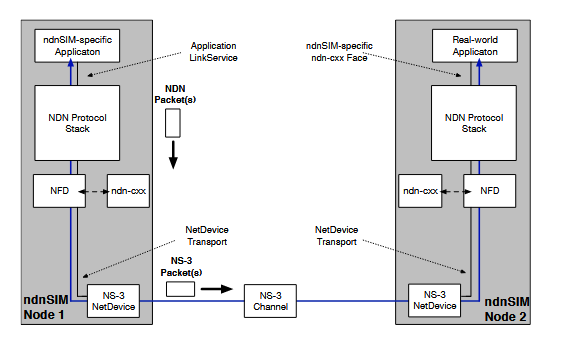

# NDN-MODULE

|module|function|filename|
|:-----:|:-------|:-------|
|ndn::L3Protocol|NS-3对NDN协议栈的抽象实现。其主要任务是初始化参与模拟场景的每个节点的NFD实例，并提供跟踪源来测量NDN性能(sent/received interest and data, satisfied/unsatisfied interests)|src/ndnSIM/model/ndn-l3-protocol.hpp|
|nfd::Forwarder|NFD的主类，拥有路由节点的所有faces和tables，并实现了NDN转发管道|src/ndnSIM/NFD/daemon/fw/forwarder.hpp|
|nfd::Face|NFD Face抽象，实现了实际发送和接收兴趣包和数据包的通信原语。[以下是源码中对Face的阐述：网络interface的泛化，一个face概括了一个网络interface。它在物理接口、覆盖隧道或到本地应用程序的链路上提供里最佳的网络层包交付服务。face包含两个部分:LinkService和Transport。Transport是较底层的部分，它提供了最好的TLV块交付。LinkService是上层的部分，它在网络层包和TLV块之间进行转换，并可能提供额外的服务，如分片和重组。]|src/ndnSIM/NFD/daemon/face/face.hpp|
|nfd::Face::LinkService|NFD LinkService基类的抽象，在网络层packet(interest、data、Nacks)和链路层packet(TLV)之间转换|src/ndnSIM/NFD/daemon/face/link-service.hpp|
|nfd::Face::Transport|NFD Transport基类的抽象，为一个face的链路服务提供尽最大努力的包交付服务|src/ndnSIM/NFD/daemon/face/transport.hpp|
|nfd::Cs|NFD使用的数据包缓存，当前版本的ndnSIM还包括从之前版本移植过来的ndn::ContentStore抽象，以便为内容存储提供更丰富的选项(nfd::Cs在缓存替换策略方面还没有那么灵活)|src/ndnSIM/NFD/daemon/table/cs.hpp|
|nfd::Pit|NFD的PIT(Pending Interest Table)，追踪向上游发送到一个(或多个)内容源的兴趣包。通过这种方式数据包可以向下游发送给一个(或多个)数据请求者|src/ndnSIM/NFD/daemon/table/pit.hpp|
|nfd::Fib|NFD的FIB(Forwarding Information Base)用于向一个(或多个)潜在数据源发送兴趣包|src/ndnSIM/NFD/daemon/table/fib.hpp|
|nfd::fw::Strategy|NFD中的转发策略，决定是否、何时、何地转发兴趣包，是一个抽象类，需要所有内置或自定义的转发策略实现|src/ndnSIM/NFD/daemon/fw/strategy.hpp|
|nfd::measurements::measurements|NFD用于存储有关名称前缀的测量信息的表，转发策略使用该表|src/ndnSIM/NFD/daemon/table/measurements.hpp|
|nfd::strategy_choice::StrategyChoice|此表包含为每个命名空间选择的转发策略|src/ndnSIM/NFD/daemon/table/strategy-choice.hpp|
|ndn::AppLinkService|实现了nfd::face::LinkService抽象类，以便与应用程序通信|src/ndnSIM/model/ndn-app-link-service.hpp|
|ndn::NetDeviceLinkService|nfd::LinkService抽象的实现，以实现与其它节点通信|-----|
|ndn::cs::*|ndnSIM1.0中实现的cs结构。包括多种替换策略|src/ndnSIM/utils/trie/*-policy.hpp|
|Basic NDN applications|实现了内置的NDN consumer和producer应用程序，可以生成和接收NDN流量。这些应用包括用户可以在模拟场景中配置的参数，从而根据用户自定义的模式生成NDN流量|-----|
|Trace helpers|一组跟踪助手，用于简化仿真的各种必要的统计信息的收集和聚合，并将这些信息写入文本文件中|-----|
|ndnSIM helpers|助手的集合，简化了在仿真执行期间使用的各种参数的配置|------|

NFD并未实现自己的传输层，而是使用LinkService抽象实现基本的通信原理。这是一种优化包处理并避免不必要的内存操作的解决方案。通过这种方式，设法维持了模拟节点发送/接收的每个包所附加的NS3包标签(tags)，否则这些标签将会丢失

# Receive执行流程

从上往下依次执行
第三步的doReceivePacket是个纯虚函数，必须由LinkService派生类具体实现
其中一个派生类是GenericLinkService(GenericLinkService是一个实现NDNLPv2协议的LinkService)

|callback function|filename|
|:----------------:|:---------:|
|void Transport::receive(Packet&& packet);|src/ndnSIM/NFD/daemon/face/transport.cpp|
|inline void LinkService::receivePacket(Transport::Packet&& packet)；|src/ndnSIM/NFD/daemon/face/link-service.hpp|
|virtual void doReceivePacket(Transport::Packet&& packet) = 0;|src/ndnSIM/NFD/daemon/face/link-service.hpp|
|void GenericLinkService::decodeNetPacket(const Block& netPkt, const lp::Packet& firstPkt);|src/ndnSIM/NFD/daemon/face/generic-link-service.cpp|

## Receive Interest

接着上面的流程

|callback function|filename|
|:----------------:|:---------:|
|void GenericLinkService::decodeInterest(const Block& netPkt, const lp::Packet& firstPkt)|src/ndnSIM/NFD/daemon/face/generic-link-service.cpp|
|void LinkService::receiveInterest(const Interest& interest)|src/ndnSIM/NFD/daemon/face/link-service.cpp|
| signal::Signal<LinkService, Interest> afterReceiveInterest;|src/ndnSIM/NFD/daemon/face/generic-link-service.cpp|
|void Forwarder::onIncomingInterest(Face& inFace, const Interest& interest);|src/ndnSIM/NFD/daemon/fw/forwarder.cpp|
|void Producer::OnInterest(shared_ptr<const Interest> interest);|src/ndnSIM/apps/ndn-producer.cpp|

## Receive Data

接着上面的流程

|callback function|filename|
|:----------------:|:---------:|
|void GenericLinkService::decodeData(const Block& netPkt, const lp::Packet& firstPkt)|src/ndnSIM/NFD/daemon/face/generic-link-service.cpp|
|void LinkService::receiveData(const Data& data)|src/ndnSIM/NFD/daemon/face/link-service.cpp|
|signal::Signal<LinkService, Data> afterReceiveData;|src/ndnSIM/NFD/daemon/face/generic-link-service.cpp|
|void Forwarder::onIncomingData(Face& inFace, const Data& data)|src/ndnSIM/NFD/daemon/fw/forwarder.cpp|

# send执行流程

## send Interest

第三步的doReceivePacket是个纯虚函数，必须由LinkService派生类具体实现
其中一个派生类是GenericLinkService(GenericLinkService是一个实现NDNLPv2协议的LinkService)

|callback function|filename|
|:----------------:|:---------:|
|void Consumer::SendPacket();|src/ndnSIM/apps/ndn-consumer.cpp|
|void Forwarder::onOutgoingInterest(const shared_ptr\<pit::Entry>& pitEntry, Face& outFace, const Interest& interest);|src/ndnSIM/NFD/daemon/fw/forwarder.cpp|
|inline void Face::sendInterest(const Interest& interest);|src/ndnSIM/NFD/daemon/face/face.hpp|
|void GenericLinkService::doSendInterest(const Interest& interest)|src/ndnSIM/NFD/daemon/face/generic-link-service.cpp|
|void GenericLinkService::encodeLpFields(const ndn::PacketBase& netPkt, lp::Packet& lpPacket);|src/ndnSIM/NFD/daemon/face/generic-link-service.cpp|
|void GenericLinkService::sendNetPacket(lp::Packet&& pkt, bool isInterest);|src/ndnSIM/NFD/daemon/face/generic-link-service.cpp|
|void GenericLinkService::sendLpPacket(lp::Packet&& pkt);|src/ndnSIM/NFD/daemon/face/generic-link-service.cpp|
|inline void LinkService::sendPacket(Transport::Packet&& packet)；|src/ndnSIM/NFD/daemon/face/link-service.hpp|
|void Transport::send(Packet&& packet)；|src/ndnSIM/NFD/daemon/face/transport.cpp|
|signal::Signal<LinkService, Interest> afterSendInterest;|src/ndnSIM/NFD/daemon/face/link-service.hpp|

## send Data

第三步的doSendData是个纯虚函数，必须由LinkService派生类具体实现
其中一个派生类是GenericLinkService(GenericLinkService是一个实现NDNLPv2协议的LinkService)

|callback function|filename|
|:----------------:|:---------:|
|void Forwarder::onOutgoingData(const Data& data, Face& outFace);|src/ndnSIM/NFD/daemon/fw/forwarder.cpp|
|inline void Face::sendData(const Data& data);|src/ndnSIM/NFD/daemon/face/face.hpp|
|virtual void doSendData(const Data& data) = 0;|src/ndnSIM/NFD/daemon/face/link-service.hpp|
|void GenericLinkService::doSendData(const Data& data);|src/ndnSIM/NFD/daemon/face/generic-link-service.cpp|
|void GenericLinkService::encodeLpFields(const ndn::PacketBase& netPkt, lp::Packet& lpPacket);|src/ndnSIM/NFD/daemon/face/generic-link-service.cpp|
|void GenericLinkService::sendNetPacket(lp::Packet&& pkt, bool isInterest);|src/ndnSIM/NFD/daemon/face/generic-link-service.cpp|
|void GenericLinkService::sendLpPacket(lp::Packet&& pkt);|src/ndnSIM/NFD/daemon/face/generic-link-service.cpp|
|inline void LinkService::sendPacket(Transport::Packet&& packet)；|src/ndnSIM/NFD/daemon/face/link-service.hpp|
|void Transport::send(Packet&& packet)；|src/ndnSIM/NFD/daemon/face/transport.cpp|
|signal::Signal<LinkService, Data> afterSendData;|src/ndnSIM/NFD/daemon/face/link-service.hpp|

# NDN两个模拟节点之间的包交换过程

ndnSIM中的packet flow涉及多个要素，包括NS3的packet、device、channel abstraction、ndnSIM core 和 以及集成的NFD借助ndn-cxx进行处理。下图说明了在两个模拟节点之间转发NDN包的整个工作流程。

整个过程由表达兴趣或发布数据包(在收到兴趣后)的应用程序启动，包括使用集成的ndn-cxx库提供的抽象功能生成兴趣和数据包(并对其进行适当的签名)。使用专门的ndnSIM Face(使用AppLinkService)或一个定制版本的ndn-cxx Face(使用InternalClientTransport和InternalForwarderTransport底层抽象)。这些packets会被注入安装在相应模拟节点上的NFD实例，之后，NFD将应用必要的处理逻辑，并决定如何处理这些packet，即创建一个PIT条目并转发到一个由兴趣名称空间策略决定的传出Face。聚合或丢弃兴趣，从内部缓存中满足兴趣，缓存收到数据包并将其转发给传入的Face，或丢弃数据包。如果确定要将数据包发送到与模拟链路相对应的Face，该数据包将被编码为NS3的数据包，并通过使用专门的NetDeviceTransport抽象的Face在NS3的NetDevice/Channel上调度传输。在另一端，从NS3的Packet中提取出NDN Packet，并注入NFD实例进行进一步处理。
